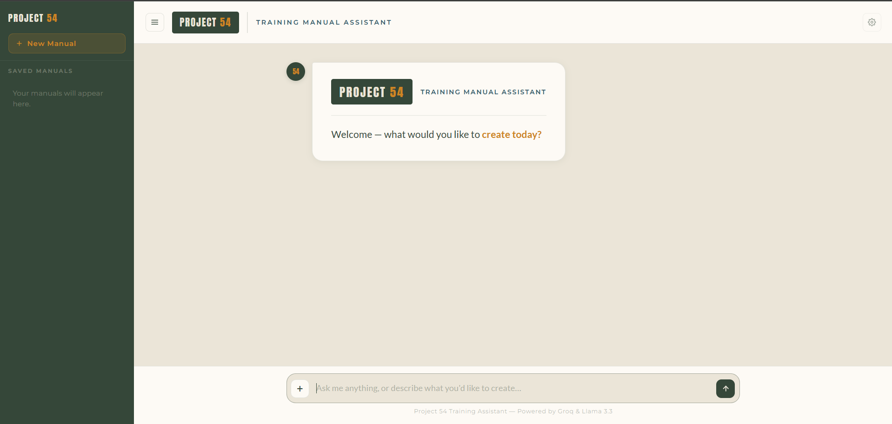

# Project 54 — Training Manual Assistant

A browser-based chat app for asking questions about uploaded training manuals (PDF / DOCX). Powered by Groq + Llama 3.3 70B. Runs entirely client-side — your documents never leave the browser.



## Status

Active development — there is still a lot to build. Treat this as a work in progress, not a finished product.

## Features

- Upload training manuals as PDF or DOCX and chat with their contents
- Saved manuals persist locally in `localStorage` — no backend, no sign-in
- Voice input via the browser's Speech Recognition API
- Audio attachments and image attachments in the chat
- Export conversations to PDF

## Tech stack

- Vanilla HTML / CSS / JavaScript (no build step)
- [Groq API](https://groq.com) with Llama 3.3 70B for the chat backend
- [PDF.js](https://mozilla.github.io/pdf.js/) for PDF parsing
- [Mammoth.js](https://github.com/mwilliamson/mammoth.js) for DOCX parsing
- [jsPDF](https://github.com/parallax/jsPDF) for PDF export
- `localStorage` for persistence

## Running locally

The app is a static site, so any static file server will do.

```bash
git clone https://github.com/<your-username>/training-ai-assistant.git
cd training-ai-assistant

# Option A: Python
python -m http.server 8000

# Option B: Node
npx serve .
```

Then open `http://localhost:8000` in your browser. Get a free API key from [console.groq.com](https://console.groq.com) and paste it into the in-app field to start chatting.

## License

[MIT](./LICENSE)
